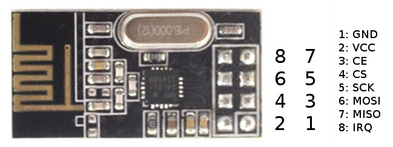

# [모듈] nRF24L01_
=======================
## [# 통신SPI] Serial Peripheral Interface
* https://cafe.naver.com/lsg20004/385
---
## [# 모듈]

---
## [# 설명서]

---
## [라이브러리]
* 라이브러리 및 소스 코드
가장 안정적이고 기능이 많은 TMRh20 / RF24 라이브러리를 주로 사용

* [TMRh20 / RF24] (https://github.com/nRF24/RF24) https://www.arduinolibraries.info/libraries/rf24
* https://github.com/maniacbug
---


### [예제]
* https://stemwith.github.io/2021/10/10/ESP32-nRF24L01/


---
# [# 조정방법]
### 

```
```
---